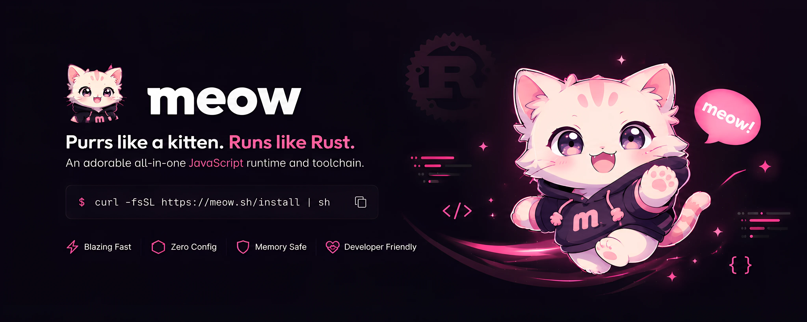

<div align="center">
  
</div>

<div align="center">
  <h1>meow</h1>
  <p><strong>Looks like a kitten. Runs like Rust.</strong></p>
  <p>
    <a href="https://github.com/meowmeow-sh/meow/actions"></a>
    <a href="https://github.com/meowmeow-sh/meow/blob/main/LICENSE"></a>
    <a href="https://meow.style"></a>
    <a href="https://github.com/meowmeow-sh/meow/stars"></a>
  </p>
</div>

---

`meow` is a JavaScript and TypeScript runtime, package manager, test runner, linter, formatter, and typechecker — delivered as a single Rust binary.

It is not a Node.js wrapper. It is not an academically pure runtime that asks you to abandon npm. It is a drop-in replacement: your `package.json` stays, your code stays, your existing dependencies work. The toolchain gets replaced.

```ts
import { serve } from "meow:http";

serve({
  port: 3000,
  fetch(req) {
    return new Response("meow! v8 isolate booted in 18ms");
  }
});
```

---

## Quick start

```bash
# 1. install
curl -fsSL https://meow.style/install | sh

# 2. drop into any existing project
git clone https://github.com/your/project.git
cd project

# 3. install and run
meow install
meow run dev
```

Your `package.json` scripts work unchanged. `meow run <script>` executes them; `meow <script>` is shorthand.

---

## Why meow

### One parse

Webpack, ESLint, Prettier, and Jest all parse your TypeScript independently. meow uses the Oxc parser to parse your codebase exactly once in memory. The same AST feeds the runtime, linter, formatter, and bundler. Re-parsing is a bug.

TypeScript annotations are erased in-place — zero-allocation whitespace stripping that preserves 1:1 byte offsets. No sourcemaps. No emit step. No transpilation.

### Drop-in compatibility

meow boots Next.js, Astro, and Vite without configuration changes. Node built-ins (`fs`, `path`, `crypto`), `process`, `Buffer`, CommonJS, and N-API addons work natively through upstream Deno crates (`deno_node`, `deno_napi`, `deno_crypto`).

When invoked as `node`, meow normalizes Node-style arguments and responds as a drop-in. Your existing projects run.

### Fast installs

Packages download to a global content-addressed cache once. On macOS, they project into your project's `node_modules` using the kernel's `clonefile(2)` syscall — milliseconds, zero duplicated bytes. Linux and Windows fall back to hardlinks.

If a package is locked in `meow.lock.jsonl`, meow bypasses npm registry metadata fetching entirely. Warm installs drop to ~20ms. Every tarball is verified with SHA-256, but cryptography and decompression run on background OS threads to keep the network pool saturated.

### Hermetic tests

`meow test` freezes the system clock at a virtual epoch, seeds the RNG with a deterministic ChaCha20 stream, and hides environment variables by default. Flaky tests stop being flaky.

Network and filesystem access are explicit grants, not assumptions. `--allow-net`, `--allow-read`, `--allow-env` — or nothing.

---

## Performance

meow runs on V8 — the same engine as Node.js. Hot-loop JavaScript throughput is at parity, not 10× faster. The wins are in the native toolchain: cold start, install, lint, format, and test orchestration.

| Metric | Node.js | meow |
| :--- | :--- | :--- |
| Cold install (1,600+ packages) | ~45–60s | **12.5s** |
| Warm install (lockfile hit) | ~10s | **0.8s** |
| TypeScript execution startup | ~180ms | **18ms** |
| Linter throughput | ~200 files/s | **11,000+ files/s** |

We won't claim what won't benchmark. (=^・ω・^=)

---

## CLI

```bash
meow install                # resolve, cache, lock, materialize node_modules
meow add <pkg>               # add to package.json, then install
meow remove <pkg>            # remove from package.json, then reinstall
meow run <script|file>       # execute a package.json script or file
meow dev                     # shorthand for meow run dev
meow test                    # hermetic test runner (meow:test API)
meow check                   # typecheck via tsc/tsgo over shadow tsconfig
meow lint [--fix]            # lint over the shared Oxc graph
meow fmt [--check]           # format via Oxc codegen
meow bundle <entries>        # bundle over the shared module graph
meow why-dep <pkg>           # trace dependency ancestry through the lockfile
meow sync                    # regenerate shadow TypeScript config
meow types [--emit|--check]  # regenerate or verify meow:* type declarations
```

Opt-in flags for stricter profiles:

```bash
meow run --mode strict-web              # withdraw Node globals for portable edge projects
meow test --allow-clock                  # use real system clock instead of frozen time
meow run --allow-net=api.example.com:443 # grant scoped network access
meow run --frozen                        # refuse lockfile or graph changes
```

---

## What doesn't work yet

Trust is the only currency that matters for a runtime. Here is what meow **cannot** do today:

- **Native C++ addons (.node):** The N-API bridge is incomplete. Packages that rely on precompiled C++ binaries (like older `bcrypt`) will fail. WASM-based alternatives work.
- **The bundler is a starter:** It walks the module graph and emits valid output, but tree-shaking is basic and minification is limited. Not a production-grade replacement for esbuild yet.
- **The linter is minimal:** It catches `debugger` statements and `console.log` calls. Full rule sets are on the roadmap.

We'd rather tell you now than have you find out in production.

---

## Architecture

meow is a Cargo workspace with strict crate boundaries:

| Crate | Role |
|---|---|
| `meow-runtime` | The V8 embedding. Sole `deno_core` edge. Owns `JsRuntime`, ops, extensions. |
| `meow-graph` | The single Oxc parser. Incremental query system: CST → Semantic → RuntimeIR. |
| `meow-loader` | Module resolution + loading. Bridges runtime and graph. |
| `meow-pkg` | Lockfile, cache, install, resolution graph, materialization. |
| `meow-config` | `meow.config.json` schema, shadow tsconfig generation, package.json helpers. |
| `meow-tool` | Lint, format, bundle — all consume the shared `GraphDb`. |
| `meow-obs` | Dependency path tracing (`why-dep`). |
| `meow-cli` | The binary edge. Wires all crates together. |

Key boundaries: only `meow-runtime` touches V8. Only `meow-graph` parses. Only `meow-cli` reads host state. The hermetic seam (`crates/runtime/src/hermetic/`) is the sole location where `SystemTime::now`, `getrandom`, and `std::env::var` may appear.

---

## Community

Issues and PRs welcome on [GitHub](https://github.com/meowmeow-sh/meow).

Documentation at [meow.style/docs](https://meow.style/docs/).

---

MIT / Apache-2.0 licensed. Built in Rust. Says nyaa~
